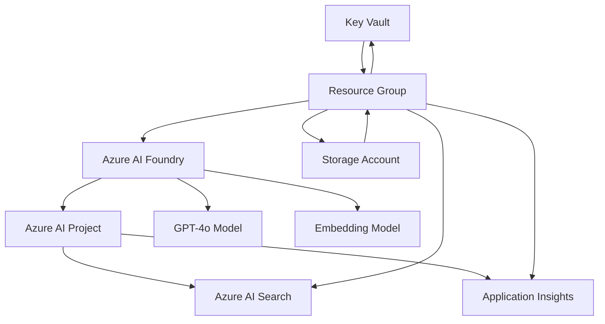

# Infrastructure as Code (IaC) Deployment

This guide walks you through deploying all Azure AI Foundry resources using Infrastructure as Code with Azure Bicep templates.

## Overview

The IaC deployment automates the creation of all Azure resources required for the workshop:

- **Azure AI Foundry** - AI Services account with project management enabled
- **Azure AI Project** - Project within the AI Foundry service
- **Model Deployments** - GPT-4o and text-embedding-ada-002 models
- **Azure AI Search** - Vector search for RAG applications
- **Azure Monitor** - Application Insights for observability
- **Supporting Resources** - Key Vault, Storage Account, and proper IAM roles

## Prerequisites

Before running the deployment, ensure you have:

1. **Azure CLI** installed and configured
   ```bash
   # Install Azure CLI
   # Visit: https://docs.microsoft.com/en-us/cli/azure/install-azure-cli
   
   # Verify installation
   az --version
   ```

2. **Azure Subscription** with sufficient permissions
   - Contributor role on the subscription or resource group
   - Ability to create service principals and role assignments

## Quick Start

### 1. Deploy Resources

Run the deployment script from the workshop root directory:

```bash
bash deploy/deploy.sh
```

The script will:
- Validate prerequisites and Azure authentication
- Prompt for configuration (resource group, location, AI Foundry name)
- Create resource group if it doesn't exist
- Purge deleted Key Vaults to avoid naming conflicts
- Deploy all Azure resources using Bicep templates
- Automatically generate your `.env` file with connection details

### 2. Verify Deployment

After deployment completes, verify everything is working:

```bash
bash scripts/test-environment.sh
```

### 3. Start the Workshop

Launch the workshop environment by opening the provided Jupyter notebooks in the `notebooks/` directory.

## Deployment Configuration

### Resource Naming

The deployment uses a unique naming convention to avoid conflicts:

- **Resource Group**: `rg-azure-ai-foundry-workshop` (default)
- **AI Foundry**: `aifoundry-{timestamp}` (e.g., `aifoundry-12251430`)
- **AI Project**: `{aifoundry-name}-proj`
- **Search Service**: `search-{uniqueSuffix}`
- **Key Vault**: `kv-{timestamp}`
- **Storage Account**: `storage{uniqueSuffix}`
- **Application Insights**: `insights-{uniqueSuffix}`

### Default Configuration

| Resource | Configuration |
|----------|---------------|
| **Azure AI Foundry** | Standard (S0) tier, AIServices kind |
| **Chat Model** | GPT-4o (2024-08-06), GlobalStandard SKU |
| **Embedding Model** | text-embedding-ada-002 (version 2) |
| **Azure Search** | Free tier |
| **Application Insights** | Standard monitoring |
| **Key Vault** | Standard tier, 7-day soft delete |
| **Storage Account** | Standard_LRS, Hot tier |

### Customization

To customize the deployment, you can:

1. **Modify the Bicep template**: `deploy/main.bicep`
2. **Pass parameters to the script**:
   ```bash
   # Example: Deploy to a specific resource group
   RESOURCE_GROUP_NAME="my-custom-rg" bash deploy/deploy.sh
   ```
3. **Use environment variables** to override defaults:
   ```bash
   AI_FOUNDRY_NAME="my-foundry" bash deploy/deploy.sh
   ```

## Deployment Architecture



## Generated Environment Configuration

After successful deployment, your `.env` file will contain:

```bash
# Azure Subscription and Tenant Information
SUBSCRIPTION_ID=your-subscription-id
TENANT_ID=your-tenant-id

# Azure AI Foundry Project Configuration
AIPROJECT_ENDPOINT=/subscriptions/{subscription-id}/resourceGroups/{rg}/providers/Microsoft.CognitiveServices/accounts/{foundry-name}/projects/{project-name}

# Azure AI Foundry Configuration
AZURE_OPENAI_ENDPOINT=https://your-foundry-service.openai.azure.com/
AZURE_OPENAI_KEY=your-api-key

# Model deployment names
MODEL_DEPLOYMENT_NAME=gpt-4o
EMBEDDING_MODEL_DEPLOYMENT_NAME=text-embedding-ada-002
CHAT_MODEL=gpt-4o
EVALUATION_MODEL=gpt-4o

# Azure AI Search Configuration
AZURE_SEARCH_ENDPOINT=https://your-search-service.search.windows.net
AZURE_SEARCH_KEY=your-search-key
AZURE_SEARCH_INDEX_NAME=rag-mini-wikipedia

# Monitoring and Observability
AZURE_MONITOR_CONNECTION_STRING=your-app-insights-connection-string

# Workshop Settings
WORKSHOP_NAME=Azure AI Foundry Workshop
WORKSHOP_VERSION=1.0.0
```

## Security and Permissions

The deployment automatically configures proper IAM roles:

- **AI Project → Search Service**: Search Index Data Contributor
- **Managed Identity**: System-assigned identities for AI Foundry and AI Project
- **Authentication**: AI Services uses managed identity with disabled local auth

## Cost Considerations

The default deployment creates resources with the following approximate costs:

| Resource | Tier | Estimated Monthly Cost |
|----------|------|----------------------|
| Azure AI Foundry | Standard (S0) | $20-50 (usage-based) |
| Azure AI Search | Free | $0 |
| Application Insights | Standard | $5-15 |
| Storage/Key Vault | Standard | $5-10 |

**Total estimated cost: $30-75/month**

> **Note**: Costs vary based on usage patterns and region. Monitor your usage in the Azure portal.

## Troubleshooting

### Common Issues

1. **Deployment Fails - Quota Exceeded**
   ```bash
   # Check your quota limits
   az vm list-usage --location eastus --output table
   
   # Try a different region
   bash deploy/deploy.sh
   # Enter different location when prompted
   ```

2. **Model Deployment Fails**
   - Some regions have limited model availability
   - Try regions like: `eastus`, `westus2`, `northcentralus`

3. **Permission Errors**
   ```bash
   # Verify your account has proper roles
   az role assignment list --assignee $(az account show --query user.name -o tsv)
   ```

4. **Bicep Compilation Errors**
   ```bash
   # Update Azure CLI to latest version
   az upgrade
   
   # Verify Bicep is installed
   az bicep version
   ```

### Validation Steps

If deployment completes but resources aren't working:

1. **Check resource status**:
   ```bash
   # List all resources in your resource group
   az resource list --resource-group rg-azure-ai-foundry-workshop --output table
   ```

2. **Verify model deployments**:
   ```bash
   # Check AI Foundry model deployments
   az cognitiveservices account deployment list \
     --resource-group rg-azure-ai-foundry-workshop \
     --name your-ai-foundry-service-name
   ```

3. **Test connectivity**:
   ```bash
   # Run the environment test script
   bash scripts/test-environment.sh
   ```

## Cleanup

When you're done with the workshop, clean up resources to avoid ongoing costs:

```bash
bash deploy/cleanup.sh
```

This script will:
- List all workshop-related resource groups
- Show all resources to be deleted
- Require explicit confirmation
- Delete all resources permanently
