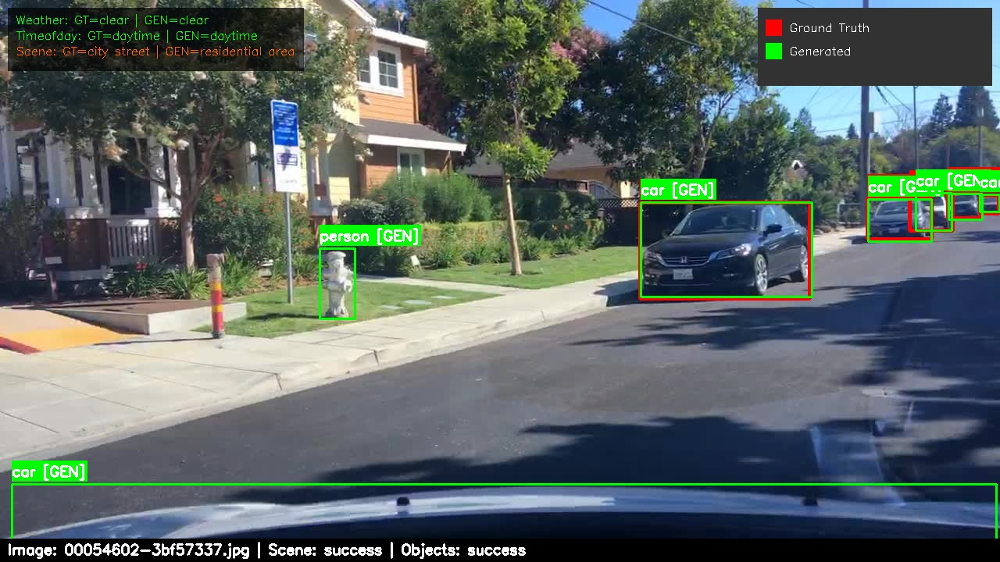

# KT Mini-Hack Auto-Labeling Challenge

## Overview

Welcome to our AI-powered auto-labeling hackathon! This hands-on challenge will guide you through building an automated annotation system for driving scene images. You'll start by experimenting with individual AI models, then gradually build up to a complete production pipeline. By the end, you'll have a system that can automatically generate labels for thousands of images using cutting-edge computer vision and language models.

## Dataset: BDD100K Image Collection

Our hackathon uses a subset of autonomous driving datasets containing:
- **The BDD100K dataset**: https://github.com/bdd100k/bdd100k
- **7,000 images** with corresponding annotation files
- **Structured labels** including weather conditions, object categories, and scene types
- **JSON format annotations** with metadata for each image

### 📦 Data Access

You will be provided with a dedicated folder in Azure Blob Storage at the following path.

```bash
<storage-account-url>/data/
├── images/
│   ├── img_00001.jpg
│   ├── img_00002.jpg
│   └── ...
└── labels/
    ├── img_00001.jpg.json
    ├── img_00002.jpg.json
    └── ...
```

For this challenge, you can:
- 🔽 **Download the data locally** for offline processing
- 🔄 **Access it programmatically** using Azure Blob Storage SDKs (e.g., `azure-storage-blob` for Python)

## Background: AI-Assisted Labeling

Manual labeling is one of the most expensive and time-consuming steps in preparing data for machine learning. In this challenge, you'll explore how AI can accelerate this process by:

- **Scene Understanding**: Classify scene context using vision-language models
- **Object Detection**: Employing computer vision models to detect and localize objects
- **Quality Assessment**: Evaluating AI-generated labels against ground truth
- **Pipeline Automation**: Building scalable systems for processing large datasets

---

## 🧪 Task 1: Scene Analysis with Vision-Language Models

**🎯 Goal**: Use AI to understand what's happening in driving scene images

**📝 Start Simple**: Begin by analyzing individual images to extract scene-level information like weather, time of day, and scene type.

### 🔧 What You'll Build

A system that takes a driving scene image and automatically determines:

1. **Weather conditions**: sunny, rainy, foggy, overcast, etc.
2. **Time of day**: day, night, dusk, dawn
3. **Scene type**: highway, city street, residential area, parking lot, etc.

---

### 🖼️ Sample Output

```json
{
  "attributes": {
    "weather": "clear",
    "timeofday": "daytime",
    "scene": "city street"
  }
}
```

### 🎓 Key Learning Objectives

- Understand vision-language model capabilities
- Learn prompt engineering for multimodal inputs
- Work with AI APIs and handle responses

### 📋 Suggested Workflow

1. **Choose a vision-language model** — Create a resource and deploy your preferred model
2. **Load the image** — from Azure Blob Storage or local disk
3. **Create a prompt** — clearly instruct the model to return a structured JSON
4. **Send image + prompt** to the model via API
5. **Parse and validate** the structured output

---

### 🧰 Implementation Approaches

You have two common ways to approach this task using vision-language models:

#### 🌀 Option 1: Using OpenAI Vision Models (e.g., GPT-4 with image input)

The most common and familiar way to perform multimodal analysis is through **OpenAI vision-capable models** like GPT-4. These models allow you to send images along with natural language prompts and receive highly descriptive, context-aware responses.

You can use either:

- **OpenAI API directly**, or
- **Azure OpenAI Service** by creating an OpenAI resource in the Azure portal and enabling the GPT-4 model family with vision support.

**✅ Benefits**:

- Strong general reasoning and contextual understanding
- Flexible and expressive responses
- Familiar programming interface for those who've used OpenAI's chat models

**Typical Use Case**:
You encode the image (e.g., as base64 or image URL) and pass it along with a system/user prompt asking for structured output like weather, time of day, and scene type.

**Sample Code**:
```python
from openai import AzureOpenAI

def classify_scene(image_path):
    # Initialize Azure OpenAI client
    client = AzureOpenAI(
        azure_endpoint="YOUR_ENDPOINT",
        api_key="YOUR_API_KEY",
        api_version="2024-10-21"
    )

    # ... convert image to base64 ...

    # Call the API
    response = client.chat.completions.create(
        model="gpt-4o",  # Your deployment name
        messages=[
            {
                "role": "user",
                "content": [
                    {"type": "text", "text": "...your analysis request..."},
                    {
                        "type": "image_url",
                        "image_url": {"url": "data:image/jpeg;base64,..."}
                    }
                ]
            }
        ],
        max_tokens=512,
        temperature=0.2
    )

    # ... parse and return results ...
    return response.choices[0].message.content
```

---

#### 🌀 Option 2: Using Smaller Models via Azure AI Foundry (e.g., phi-4)

Other than OpenAI models, you can also use **smaller multimodal models** like `phi-4-multimodal-instruct` via **Azure AI Foundry**. Foundry provides a **model catalog** where you can deploy and use open-access and Microsoft-trained models optimized for specific tasks.

For this task, `phi-4` is a strong fit because:

- It is **optimized for instruction-following**, meaning it reliably outputs structured responses like JSON
- It is **lightweight and fast**, making it ideal for real-time or batch processing at lower cost
- It integrates easily into **Azure-based infrastructure**, including managed identity and AzureML pipelines

**✅ Benefits**:

- Lower latency and compute cost compared to large foundation models
- Deterministic and structured behavior with clear prompts
- No dependency on OpenAI quota or limits

**When to Choose This**:

- You want to run at scale, with speed and predictable output
- You're okay with less contextual depth in exchange for performance
- You want full control over model deployments on Azure

**Sample Code**:
```python
from azure.ai.inference import ChatCompletionsClient
from azure.core.credentials import AzureKeyCredential

def classify_scene(image_path):
    # Initialize Azure AI client
    client = ChatCompletionsClient(
        endpoint="YOUR_ENDPOINT",
        credential=AzureKeyCredential("YOUR_API_KEY"),
        api_version="2024-12-01-preview"
    )

    # ... convert image to base64 ...

    # Call the API
    response = client.complete(
        model="Phi-4-multimodal-instruct",
        messages=[
            {"role": "system", "content": "...your prompt..."},
            {
                "role": "user",
                "content": [
                    {"type": "image_url", "image_url": {"url": "data:image/jpeg;base64,..."}}
                ]
            }
        ],
        max_tokens=512,
        temperature=0.2
    )

    # ... parse and return results ...
    return response.choices[0].message.content
```

---

### 📌 Summary: When to Use What?

| Use Case                                  | Recommended Option                        |
|-------------------------------------------|--------------------------------------------|
| Familiar interface, rich reasoning         | OpenAI Vision Models (e.g., GPT-4, GPT-4o) |
| Fast and structured attribute extraction   | Phi models (via Azure AI Foundry)          |
| Azure-native pipelines or managed identity | Azure AI Foundry (any model)               |
| Control over deployment + cost efficiency  | Phi or other Foundry models                |

---

### 📚 Reference Materials

- [Deploy Azure OpenAI Resources](https://learn.microsoft.com/en-us/azure/ai-foundry/openai/how-to/create-resource?pivots=web-portal)
- [Azure OpenAI Python SDK](https://learn.microsoft.com/en-us/azure/ai-foundry/openai/supported-languages?tabs=dotnet-secure%2Csecure%2Cpython-key%2Ccommand&pivots=programming-language-python)
- [Azure OpenAI Vision-enabled chat](https://learn.microsoft.com/en-us/azure/ai-foundry/openai/gpt-v-quickstart?tabs=command-line%2Ckeyless%2Ctypescript-keyless&pivots=programming-language-python)
- [Deploy Azure Foundry Models](https://learn.microsoft.com/en-us/azure/ai-foundry/foundry-models/how-to/create-model-deployments?pivots=ai-foundry-portal)
- [Use multimodal chat models in Azure AI Foundry](https://learn.microsoft.com/en-us/azure/ai-foundry/foundry-models/how-to/use-chat-multi-modal?context=%2Fazure%2Fai-foundry%2Fcontext%2Fcontext&pivots=programming-language-python)
- [Image Prompt Engineering Techniques](https://learn.microsoft.com/en-us/azure/ai-foundry/openai/concepts/gpt-4-v-prompt-engineering)

### 📔 Solution Reference
[`src/models/scene_classification/`](./src/models/scene_classification/) - Multiple implementations (Azure OpenAI, Azure Foundry Multi-Modal ChatCompletion Model)

---

## 🧪 Task 2: Object Detection – Finding Things in Images

**🎯 Goal**: Detect and locate objects in driving scenes using bounding boxes

**📝 Expand Your Vision**: Now that you've classified the overall scene, let's identify the specific elements in it—cars, pedestrians, traffic signs, and more.

### 🔧 What You'll Build

A system that takes a driving scene image and outputs structured annotations including:

1. **Object categories**: car, person, traffic light, traffic sign, etc.
2. **Bounding boxes**: Precise (x, y) coordinates for each object
3. **Confidence scores**: Only include in the output objects above a defined confidence threshold

---

### 🖼️ Sample Output
```json
[
  {
    "id": "1",
    "category": "car",
    "box2d": {
      "x1": 645.24, "y1": 330.60,
      "x2": 956.51, "y2": 499.54
    }
  },
  {
    "id": "2",
    "category": "person",
    "box2d": {
      "x1": 120.15, "y1": 250.30,
      "x2": 180.45, "y2": 420.15
    }
  }
]
```

### 🎓 Key Learning Objectives

- Learn how to use object detection models to extract object locations and categories from images
- Learn how to apply and tune confidence thresholds to filter detection results

### 📋 Suggested Workflow

1. **Choose an object detection model** — Create resources and deploy your preferred model
2. **Load the image** — from Azure Blob Storage or local file
3. **Call the model** — and receive object predictions
4. **Filter results** — based on a confidence threshold
5. **Parse and validate** the structured output

---

### 🧰 Implementation Approaches

You have several options to implement object detection, depending on your goals and constraints. Choose the one that fits your needs best:

#### 🌀 Option 1: Azure Computer Vision
This is the easiest way to get started with object detection. Azure Computer Vision is a fully managed, out-of-the-box object detection API provided by Azure. It detects a fixed set of common objects and returns bounding boxes and labels.

**✅ When to use this**
- You want a fast, no-setup way to detect objects
- You don't need custom categories or fine control
- You want to stay within Azure services

**⚠️ Considerations**
- The model is pretrained on a limited set of categories
- You can't fine-tune or retrain it directly (use **Azure Custom Vision** for that)

**Sample Code**:
```python
from azure.cognitiveservices.vision.computervision import ComputerVisionClient
from msrest.authentication import CognitiveServicesCredentials

def detect_objects(image_path):
    client = ComputerVisionClient(
        endpoint="YOUR_ENDPOINT",
        credentials=CognitiveServicesCredentials("YOUR_API_KEY")
    )
    with open(image_path, "rb") as image_stream:
        results = client.detect_objects_in_stream(image_stream)
    return [
        {
            "category": obj.object_property,
            "box2d": {
                "x1": obj.rectangle.x,
                "y1": obj.rectangle.y,
                "x2": obj.rectangle.x + obj.rectangle.w,
                "y2": obj.rectangle.y + obj.rectangle.h
            }
        } for obj in results.objects
    ]
```

---

#### 🌀 Option 2: Azure Foundry Object Detection Models (e.g., mmd-3x-yolof-r50-c5-8x8-1x-c-13)
Azure AI Foundry offers foundation models that support object detection, including open models like YOLOX and DETR. These models are deployed on **managed compute**, which gives you access to high performance but requires resource provisioning.

**✅ When to use this**
- You want to use larger or more accurate detection models
- You need more control than the prebuilt Azure CV API allows
- You're okay managing compute and deployment infrastructure

**⚠️ Considerations**
- Not available in serverless mode (must use **dedicated managed compute**)
- Requires available **compute quota** in your Azure subscription
- You are billed for **uptime**, not just per inference

**Sample Code**:
```python
import requests
import base64

def detect_objects(image_path):
    with open(image_path, "rb") as image_file:
        image_data = base64.b64encode(image_file.read()).decode("utf-8")
    payload = {"input_data": {"data": [image_data]}}
    response = requests.post(
        "YOUR_ENDPOINT",
        headers={"Authorization": "Bearer YOUR_API_KEY"},
        json=payload
    )
    return response.json().get("boxes", [])
```

---

#### 🌀 Option 3: YOLO Models
YOLOv5 is a fast, open-source object detection model you can run on your own machine using PyTorch. It's ideal for offline use, rapid iteration, or high-throughput batch annotation.

**✅ When to use this**
- You want to avoid cloud costs or latency
- You're working on many images and want to automate labeling
- You need control over the model version and runtime environment

**⚠️ Considerations**
- You need Python + PyTorch installed locally
- You must manage dependencies, GPU access (optional), and I/O
- Not ideal for web-scale or production scenarios unless containerized

**Sample Code**:
```python
import torch

def detect_objects(image_path):
    model = torch.hub.load('ultralytics/yolov5', 'yolov5s', pretrained=True)
    results = model(image_path)
    return [
        {
            "category": model.names[int(cls)],
            "box2d": {
                "x1": float(box[0]), "y1": float(box[1]),
                "x2": float(box[2]), "y2": float(box[3])
            }
        } for *box, conf, cls in results.xyxy[0]
    ]
```

---

### 📚 Reference Materials
- [Azure Computer Vision Object Detection API Documentation](https://learn.microsoft.com/en-us/azure/ai-services/computer-vision/concept-object-detection)
- [Azure Computer Vision Image Analysis Quick Start](https://learn.microsoft.com/en-us/azure/ai-services/computer-vision/quickstarts-sdk/image-analysis-client-library?pivots=programming-language-python&tabs=windows%2Cvisual-studio)
- [Vision Models in Azure Machine Learning Model Catalog](https://techcommunity.microsoft.com/blog/machinelearningblog/introducing-vision-models-in-azure-machine-learning-model-catalog/3924500)
- [YOLOv5 Quick Start](https://docs.ultralytics.com/yolov5/quickstart_tutorial/)

### 📔 Solution Reference
[`src/models/object_detection/`](./src/models/object_detection/) - Multiple implementations (Azure Computer Vision, Azure Foundry Object Detection Models, YOLO)

---

## 🧪 Task 3: Visualization – Making Results Visible

**🎯 Goal**: Visualize object detection results by drawing bounding boxes and scene attributes on the image, and compare them with ground truth annotations.

**📝 See What the Model Sees**: Now that your model can identify objects and scene context, bring the results to life through visual overlays that help validate correctness and highlight errors.

### 🔧 What You'll Build

A visualization tool that can:

- Draw bounding boxes for both **model predictions** and **ground truth annotations**, using **different colors** to distinguish between them
- Display object category labels
- Overlay scene-level information (e.g., weather, time of day, scene type)

Since you are also given the ground truth annotations in structured JSON format, we recommend that you **combine your outputs from Task 1 (scene attributes)** and **Task 2 (object detections)** to produce a similar structured file for your predictions.
This makes it easier to compare and visualize your results against the ground truth using a unified format.

---

### 🖼️ Sample Ground Truth Format

```json
{
  "name": "0a0a0b1a-7c39d841.jpg",
  "attributes": {
    "weather": "clear",
    "timeofday": "daytime",
    "scene": "highway"
  },
  "labels": [
    {
      "id": "71849",
      "attributes": {
        "occluded": true,
        "truncated": false,
        "trafficLightColor": "NA"
      },
      "category": "car",
      "box2d": {
        "x1": 555.647397,
        "y1": 304.228432,
        "x2": 574.015906,
        "y2": 316.474104
      }
    }
  ]
}
```

### 🖼️ Sample Generated Output (from Task 1 + 2)

```json
{
  "name": "0a0a0b1a-7c39d841.jpg",
  "attributes": {
    "weather": "clear",
    "timeofday": "daytime",
    "scene": "highway"
  },
  "labels": [
    {
      "id": "1",
      "category": "car",
      "box2d": {
        "x1": 555.6,
        "y1": 304.2,
        "x2": 574.0,
        "y2": 316.4
      }
    }
  ]
}
```

### 🖼️ Sample Output


---

### 📋 Suggested Workflow

1. **Load the image**
2. **Combine the results from Task 1 and Task 2** into a single prediction annotation file that matches the ground truth format
3. **Load the corresponding ground truth annotation** for the image
4. **Draw bounding boxes** for the predicted objects (e.g., in green) and ground truth objects (e.g., in red)
5. **Overlay scene-level attributes** (weather, time of day, scene type) from your generated annotation
6. **Save or display** the annotated image to visually compare the results

---

### 📚 Reference Materials

- [OpenCV Drawing Functions](https://docs.opencv.org/4.x/dc/da5/tutorial_py_drawing_functions.html)
- [OpenCV Image Annotation](https://learnopencv.com/read-display-and-write-an-image-using-opencv/)

### 📔 Solution Reference
[`src/core/visualize_results.py`](./src/core/visualize_results.py) - Visualization script

---

## 🧪 Task 4: Evaluation – Measuring Success

**🎯 Goal**: Determine how good your AI-generated annotations are compared to the ground truth.

**📝 Measure Your Progress**: Numbers don't lie! Let's calculate key metrics to quantify your solution's performance in both object detection and scene classification.

> **💡 Note**: Evaluation is critical for AI systems - you can't deploy what you can't measure, especially in safety-critical applications like autonomous driving.

### 🔧 What You'll Build

An evaluation tool that:

- Calculates **object detection metrics**: Precision, Recall, F1-score, mAP (mean Average Precision)
- Computes **scene classification accuracy**: How well your predicted attributes match ground truth
- Provides **per-category performance**: Identify strengths and weaknesses by object type
- Analyzes **IoU (Intersection over Union)** for box-level matching

---

### 🖼️ Sample Output

```json
{
  "summary": {
    "total_images": 5,
    "overall_attribute_accuracy": 0.6666666666666666,
    "precision": 0.8536585365853658,
    "recall": 0.5,
    "f1_score": 0.6306306306306306,
    "map_50": 0.8536585365853658,
    "map_50_95": 0.853658536585366
  },
  "attribute_accuracy": {
    "weather": 0.4,
    "timeofday": 0.8,
    "scene": 0.8
  },
  "per_class_metrics": {
    "person": {
      "precision": 1.0,
      "recall": 1.0,
      "f1": 1.0,
      "tp": 6,
      "fp": 0,
      "fn": 0
    },
    "vehicle": {
      "precision": 1.0,
      "recall": 1.0,
      "f1": 1.0,
      "tp": 26,
      "fp": 0,
      "fn": 0
    },
    "traffic_light": {
      "precision": 1.0,
      "recall": 1.0,
      "f1": 1.0,
      "tp": 3,
      "fp": 0,
      "fn": 0
    }
  }
}
```

---

### 📋 Suggested Workflow

1. **Load the ground truth annotation file**
2. **Load the generated prediction file** (from Task 3)
3. **Compare scene attributes**: weather, time of day, scene type
4. **Match objects** using IoU threshold (typically 0.5)
5. **Compute detection metrics**: precision, recall, F1-score, per-class stats
6. **Output evaluation summary** in a structured JSON file

---

### 🧠 Key Metrics to Understand

#### 🌤️ Scene Classification Accuracy

Scene classification is straightforward - for each image, we compare the predicted attributes (weather, time of day, scene type) with the ground truth labels. It's a simple "correct" or "incorrect" match for each attribute.

```python
def calculate_scene_accuracy(predicted_scenes, ground_truth_scenes):
    """
    Calculate accuracy for scene attributes (weather, time, scene type)
    """
    correct = 0
    total = 0

    for pred, gt in zip(predicted_scenes, ground_truth_scenes):
        for attribute in ['weather', 'timeofday', 'scene']:
            if pred.get(attribute) == gt.get(attribute):
                correct += 1
            total += 1

    return correct / total
```

**What this tells you:**
- **High accuracy (>80%)**: Your model understands scene context well
- **Low accuracy (<50%)**: The model struggles with basic scene understanding
- **Uneven performance**: Check individual attributes - maybe weather detection works but time-of-day doesn't

> **Note**: If you're using a foundation model, you might notice that there are some cases where your model doesn't use the same terms as the ground truth, though technically correct. For example, "sunny" is not the same as "clear". You can employ semantic similarity computations, create label mapping dictionaries, use more specific prompt engineering, or fine-tune your model to use the correct terminology.

#### 👁️ Object Detection Metrics

Object detection evaluation is fundamentally more challenging than scene classification because we're not just asking "what's in the image?" but "where exactly is each object, and how confident are we?" This creates several unique evaluation challenges:

**🎯 The Matching Problem**: When your model predicts a car at coordinates (100, 200, 300, 400) and the ground truth shows a car at (105, 195, 295, 405), is this the same car? How close is "close enough"?

**🔢 The Counting Problem**: If there are 3 cars in the image but your model finds 5 detections, how do we fairly measure performance? Some detections might be correct, others might be false alarms, and some real cars might be missed entirely.

**📏 The Precision vs. Recall Trade-off**: A model that's very conservative might have high precision (few false alarms) but low recall (misses many objects). Another model might catch every object but generate lots of false positives.

Understanding these challenges helps explain why object detection uses more sophisticated metrics than simple accuracy. Let's break down how to measure what really matters:

Object detection is more complex because we need to match predicted bounding boxes with ground truth boxes. Two predictions might detect the same car, or a prediction might be close but not quite right.

```python
def calculate_detection_metrics(predicted, ground_truth, iou_threshold=0.5):
    """
    Calculate precision, recall, F1 for object detection
    """
    # Match predictions to ground truth using IoU
    matches = match_detections(predicted, ground_truth, iou_threshold)

    true_positives = len(matches)
    false_positives = len(predicted) - true_positives
    false_negatives = len(ground_truth) - true_positives

    precision = true_positives / (true_positives + false_positives)
    recall = true_positives / (true_positives + false_negatives)
    f1 = 2 * (precision * recall) / (precision + recall)

    return {
        "precision": precision,
        "recall": recall,
        "f1": f1,
        "tp": true_positives,
        "fp": false_positives,
        "fn": false_negatives
    }
```

**What these metrics tell you:**
- **Precision**: "Of all the objects I detected, how many were actually correct?"
  - High precision = few false alarms
  - Low precision = lots of incorrect detections
- **Recall**: "Of all the objects that exist, how many did I find?"
  - High recall = finds most objects
  - Low recall = misses many objects
- **F1-Score**: Balances precision and recall into a single number
  - Good for comparing overall performance between models
- **IoU Threshold**: How close bounding boxes need to be to count as a match (typically 0.5 = 50% overlap)

---

### 🎓 Advanced Evaluation Concepts

- **IoU (Intersection over Union)**: Measures how closely prediction boxes align with ground truth
- **mAP (mean Average Precision)**: A comprehensive metric that reflects both detection quality and confidence ranking
- **Category Mapping**: Normalize label inconsistencies (e.g., "car" vs. "vehicle")

---

### 📚 Reference Materials
- [mAP Explained](https://jonathan-hui.medium.com/map-mean-average-precision-for-object-detection-45c121a31173)
- [Understanding IoU](https://www.pyimagesearch.com/2016/11/07/intersection-over-union-iou-for-object-detection/)
- [ML Model Evaluation](https://developers.google.com/machine-learning/crash-course/classification/accuracy)
- [COCO Detection Evaluation](https://cocodataset.org/#detection-eval)

### 📔 Solution Reference
[`src/core/evaluate_results.py`](./src/core/evaluate_results.py) - Comprehensive evaluation script

---

## 🌟 Stretch Goal: Production Pipeline & Experiment Management

**🎯 Goal**: Build an automated pipeline with run tracking for systematic experimentation

**📝 Scale & Compare**: Transform your individual components into a production-ready system that can process multiple images and track experimental results!

### 🔧 What You'll Build
A pipeline system that combines your Tasks 1-4 into an automated workflow with:

1. **Batch Processing**: Process multiple images automatically
2. **Experiment Tracking**: Keep track of different runs and configurations
3. **Error Handling**: Gracefully handle failures without stopping the entire process
4. **Performance Comparison**: Compare results across different model choices

---

### 🎓 Key Concepts to Consider

#### Pipeline Architecture
- How will you connect your scene classification, object detection, visualization, and evaluation components?
- What happens when one image fails - should the whole batch stop?
- How will you track progress across hundreds of images?

#### Configuration Management
- How can you easily switch between different models (e.g., OpenAI vs Azure Foundry)?
- What settings need to be configurable (confidence thresholds, API endpoints, etc.)?
- How will you store and version your configurations?

#### Run Management
- How will you uniquely identify each experimental run?
- What metadata should you store for each run (timestamps, configurations, results)?
- How can you resume processing if something gets interrupted?

#### Performance Analysis
- How will you compare results across different model combinations?
- What metrics matter most for your use case?
- How can you identify which approach works best for different scenarios?

---

### 🧰 Implementation Approaches

You have complete freedom in how you approach this. Some ideas to consider:

#### Simple Script Approach
```python
# Basic pipeline - process all images in a folder
def run_pipeline(image_folder, config):
    results = []
    for image_path in glob.glob(f"{image_folder}/*.jpg"):
        try:
            # Your Task 1 + 2 + 3 code here
            scene_attrs = classify_scene(image_path)
            objects = detect_objects(image_path)
            visualization = create_visualization(image_path, scene_attrs, objects)
            results.append({"image": image_path, "scene": scene_attrs, "objects": objects})
        except Exception as e:
            print(f"Failed to process {image_path}: {e}")
            continue

    # Your Task 4 evaluation code here
    evaluation = evaluate_results(results, ground_truth)
    return results, evaluation
```

#### Enterprise Pipeline Services

For production-scale systems, consider leveraging Microsoft's enterprise services:

**Azure Machine Learning (AML)** - Provides comprehensive MLOps capabilities specifically designed for machine learning workloads. Key features include:

- **Experiment Tracking**: Automatically log metrics, parameters, and artifacts from each pipeline run
- **Scalable Compute**: GPU clusters that can auto-scale based on workload demand
- **Pipeline Orchestration**: Visual designer and Python SDK for building complex ML workflows
- **Model Registry**: Version and manage your trained models with lineage tracking
- **Data Management**: Built-in data versioning and dataset management
- **Monitoring & Logging**: Real-time performance monitoring and detailed execution logs
- **Team Collaboration**: Shared workspaces with role-based access control

Ideal when processing thousands of images, need team collaboration, require automatic scaling, or want enterprise-grade MLOps capabilities.

---

#### Advanced Pipeline Ideas
- **Configuration files**: Use YAML or JSON to define different experimental setups
- **Run directories**: Create unique folders for each experimental run with timestamps
- **Resumable processing**: Track which images have been processed and skip them on restart
- **Parallel processing**: Process multiple images simultaneously for speed
- **Model ensembles**: Combine predictions from multiple models for better accuracy

---

### 📋 Sample Questions to Guide Your Design

1. **What configuration options do you want to make easily changeable?**
   - Model endpoints and API keys
   - Confidence thresholds
   - Output directories
   - Which steps to run (annotate, visualize, evaluate)

2. **How will you organize your outputs?**
   - Separate folders for each run?
   - Timestamped directories?
   - Flat structure or organized by image/step?

3. **What happens when things go wrong?**
   - API rate limits or timeouts
   - Invalid images or missing ground truth
   - Authentication failures

4. **How will you track and compare experiments?**
   - Summary statistics in JSON files?
   - Simple CSV logs?
   - Database storage?

---

### 🎓 Getting Started Suggestions

1. **Start simple**: Create a basic script that processes 5-10 images using your existing Task 1-4 code
2. **Add configuration**: Move hardcoded values (API keys, thresholds) to a config file
3. **Improve error handling**: Make sure one failed image doesn't crash the entire batch
4. **Track results**: Save your outputs in an organized way with metadata
5. **Compare approaches**: Run the same images with different model configurations and compare results

---

### 📚 Reference Materials
- [Azure Machine Learning Documentation](https://learn.microsoft.com/en-us/azure/machine-learning/)
- [Azure Machine Learning Pipeline Tutorials](https://learn.microsoft.com/en-us/azure/machine-learning/how-to-create-machine-learning-pipelines)
- [Azure Machine Learning Experiment Tracking](https://learn.microsoft.com/en-us/azure/machine-learning/how-to-track-experiments)
- [Azure Machine Learning Model Registry](https://learn.microsoft.com/en-us/azure/machine-learning/concept-model-management-and-deployment)

### 📔 Solution Reference
- See [here](./Solution.md) for a complete sample solution.
