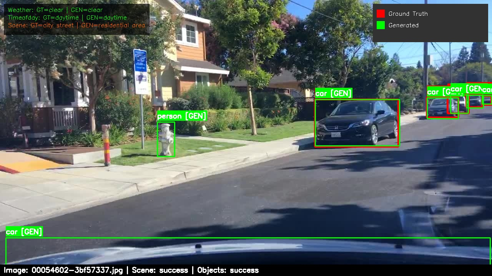

# KT Mini-Hack Auto-Labeling Challenge Solution

An extensible AI-powered image annotation pipeline that automatically generates labels for images using modular computer vision and language models. The system combines vision-language models for scene classification with object detection models to provide comprehensive image understanding.

## 🚀 Features

- **Modular AI Architecture**: Pluggable vision-language models and object detection systems
- **Dual Processing Pipeline**: Scene classification and object detection working in tandem
- **Flexible Storage Backend**: Supports local file system and cloud storage (Azure Blob)
- **Robust Error Handling**: Continues processing with configurable failure thresholds
- **Run Management**: Track and resume processing runs with unique IDs
- **Comprehensive Evaluation**: Built-in metrics for annotation quality assessment
- **Visualization Engine**: Generate annotated images with bounding boxes and labels
- **Configuration-Driven**: YAML-based configuration for easy model swapping and customization

## 📁 Project Structure

```
├── src/
│   ├── main.py                 # Main entry point
│   ├── core/
│   │   ├── annotate_image.py   # Image annotation pipeline
│   │   ├── evaluate_results.py # Evaluation metrics
│   │   ├── run_manager.py      # Run tracking and management
│   │   └── visualize_results.py # Visualization generation
│   ├── models/
│   │   ├── object_detection/   # Object detection model interfaces & implementations
│   │   └── scene_classification/ # Scene classification model interfaces & implementations
│   └── storage/                # Storage backend interfaces & implementations
├── config/                     # Sample configuration files (reference only)
│   ├── local.yaml             # Local development configuration example
│   └── local_azure_storage.yaml # Azure storage configuration example
└── pyproject.toml             # Development tools configuration
```

**Note**: Configuration files in `config/` are sample templates - copy and modify them for your specific setup.

## 🏗 Architecture

### Modular Design

The system is built with extensibility in mind:

#### Vision-Language Models
- **Interface**: `SceneClassifier` abstract base class
- **Implementations**: OpenAI GPT-4 Vision, Azure Cognitive Services (extensible)
- **Purpose**: Classify scene attributes (weather, time of day, scene type)

#### Object Detection Models
- **Interface**: `ObjectDetector` abstract base class
- **Implementations**: YOLO family, Azure Computer Vision, ONNX models (extensible)
- **Purpose**: Detect and localize objects with bounding boxes

#### Storage Backends
- **Interface**: `StorageHandler` abstract base class
- **Implementations**: Local filesystem, Azure Blob Storage (extensible)
- **Purpose**: Handle input/output operations across different storage systems

### Pipeline Flexibility

Each component can be swapped independently through configuration:

```yaml
scene_classifier:
  type: openai  # or azure_cognitive_services, custom_implementation

object_detector:
  model_type: yolov5  # or yolov8, azure_computer_vision, onnx, custom_model

storage:
  type: local  # or azure_blob, s3, custom_storage
```

## 🛠 Installation

### Prerequisites

- Python 3.8+
- Git
- Access to vision-language model APIs (Azure OpenAI, etc.)

### Setup

**Recommended: Use Dev Container**

The easiest way to get started is using the provided dev container, which includes all dependencies pre-configured:

1. **Open in dev container**:
   - Open the project in VS Code
   - Click "Reopen in Container" when prompted, or
   - Use Command Palette: `Dev Containers: Reopen in Container`

2. **The dev container includes**:
   - Python 3 with pip pre-installed
   - All system dependencies configured

**Alternative: Manual Setup**

If you prefer to set up locally:

1. **Clone the repository**:
   ```bash
   git clone <repository-url>
   cd kt-minihack-autolabeling-challenge
   ```

2. **Install dependencies**:
   ```bash
   make install-dev
   ```

**Common Setup Steps (Both Methods)**

3. **Create data directories (if you want to use local storage)**:
   ```bash
   mkdir -p data/{raw/images,raw/labels,models,output}
   ```

4. **Configure your setup**:
   Copy a sample config and customize:
   ```bash
   cp config/local.yaml my_config.yaml
   # Edit my_config.yaml with your model endpoints, storage paths, etc.
   ```

5. **Set environment variables (See .envtemplate for an example)**:
   ```bash
   export AZURE_OPENAI_ENDPOINT="your-endpoint"
   export AZURE_OPENAI_API_KEY="your-api-key"
   # Add other API keys as needed for your chosen models
   ```

## 📖 Usage

### Basic Commands

The application supports three main actions:

#### 1. Run Processing Pipeline
```bash
python src/main.py run --config my_config.yaml
```

#### 2. List All Runs
```bash
python src/main.py list
```

#### 3. Check Run Status
```bash
python src/main.py status --run-id run_20250705_205834
```

### Advanced Usage

#### Process Specific Steps
```bash
# Run only annotation
python src/main.py run --processes annotate

# Run annotation and visualization
python src/main.py run --processes annotate,visualize

# Run full pipeline
python src/main.py run --processes annotate,visualize,evaluate
```

#### Limit Processing for Testing
```bash
# Process only 10 images
python src/main.py run --limit 10
```

#### Resume Existing Run
```bash
python src/main.py run --run-id run_20250705_205834
```

### Configuration Examples

The system supports multiple model combinations through configuration. Here's what's currently implemented and available:

#### Vision-Language Model Configuration

**Currently Implemented**: AzureOpenAI, Azure AI Foundry Multi-modal ChatCompletion Models
```yaml
# Option 1: Azure OpenAI
scene_classifier:
  type: openai                    # Only implementation available
  endpoint: ${AZURE_OPENAI_ENDPOINT}
  api_key: ${AZURE_OPENAI_API_KEY}
  model_name: gpt-4o             # or gpt-4-vision-preview
  temperature: 0.2               # Controls response randomness (0.0-1.0)
  max_tokens: 512                # Maximum response length
  api_version: 2024-12-01-preview # Azure OpenAI API version
  prompt_version: v1             # Internal prompt template version

# Option 2: Azure AI Foundry Multi-modal ChatCompletion Models (Phi-4-multimodal-instruct)
scene_classifier:
  type: phi # Options: openai, phi
  endpoint: ${AZURE_FOUNDRY_CHAT_COMPLETION_MODEL_ENDPOINT} # Direct environment variable
  api_key: ${AZURE_FOUNDRY_CHAT_COMPLETION_MODEL_API_KEY} # Direct environment variable
  model_name: Phi-4-multimodal-instruct # Model configuration
  prompt_version: v1 # Prompt version to use
  temperature: 0.2 # Model temperature
  max_tokens: 512 # Max response tokens
  api_version: 2024-05-01-preview
```

*Note: To use other vision-language models (Google Gemini, Anthropic Claude Vision, etc.), you'll need to implement the `SceneClassifier` interface.*

#### Object Detection Model Configuration

**Currently Implemented**: Azure Computer Vision, Azure AI Foundry ObjectDetection Models, YOLO
```yaml
# Option 1: Azure Computer Vision
object_detector:
  model_type: azure_computer_vision  # Implementation available
  endpoint: ${AZURE_COMPUTER_VISION_ENDPOINT}
  api_key: ${AZURE_COMPUTER_VISION_API_KEY}
  confidence_threshold: 0.25

# Option 2: Azure Foundry Object Detection Models (mmd-3x-yolof-r50-c5-8x8-1x-c-13)
object_detector:
    model_type: azure_foundry # Implementation available
    endpoint: ${AZURE_FOUNDRY_OBJECT_DETECTION_ENDPOINT} # Direct environment variable
    api_key: ${AZURE_FOUNDRY_OBJECT_DETECTION_API_KEY} # Direct environment variable
    deployment_name: "mmd-3x-yolof-r50-c5-8x8-1x-c-13"
    confidence_threshold: 0.5

# Option 3: YOLO Models (YOLOv5, YOLOv8, etc.)
object_detector:
  model_type: yolov5            # Implementation available
  model_path: ./data/models/yolov5s.pt  # Local model file path
  confidence_threshold: 0.25    # Minimum detection confidence (0.0-1.0)
```

*Note: For other object detection models (TensorFlow, PyTorch, ONNX models), you'll need to implement the `ObjectDetector` interface.*

#### Storage Backend Configuration

**Currently Implemented**: Local filesystem and Azure Blob Storage
```yaml
# Option 1: Local Storage
storage:
  images:
    type: local                 # Implementation available
    path: ./data/raw/images
  generated_annotations:
    type: local
    path: ./data/output/${RUN_ID}/annotations

# Option 2: Azure Blob Storage
storage:
  images:
    type: azure_blob           # Implementation available
    account_endpoint: ${AZURE_STORAGE_ACCOUNT_ENDPOINT}
    account_key: ${AZURE_STORAGE_ACCOUNT_KEY}
    container_name: images
  generated_annotations:
    type: azure_blob
    account_endpoint: ${AZURE_STORAGE_ACCOUNT_ENDPOINT}
    account_key: ${AZURE_STORAGE_ACCOUNT_KEY}
    container_name: annotations
```

*Note: For other storage backends (AWS S3, Google Cloud Storage, etc.), you'll need to implement the `StorageHandler` interface.*

#### Complete Configuration Examples

**Local Development Setup**:
```yaml
# Minimal local setup
environment: local
storage:
  base_output:
    type: local
    path: ./data/output

annotate:
  storage:
    images:
      type: local
      path: ./data/raw/images
    generated_annotations:
      type: local
      path: ./data/output/${RUN_ID}/annotations

  scene_classifier:
    type: openai
    endpoint: ${AZURE_OPENAI_ENDPOINT}
    api_key: ${AZURE_OPENAI_API_KEY}
    model_name: gpt-4o

  object_detector:
    model_type: yolov5
    model_path: ./data/models/yolov5s.pt
    confidence_threshold: 0.25
```

**Hybrid Cloud Setup**:
```yaml
# Using Azure Blob Storage with local processing
environment: local
storage:
  base_output:
    type: azure_blob
    account_endpoint: ${AZURE_STORAGE_ACCOUNT_ENDPOINT}
    container_name: outputs

annotate:
  storage:
    images:
      type: local
      path: ./data/raw/images
    generated_annotations:
      type: azure_blob
      account_endpoint: ${AZURE_STORAGE_ACCOUNT_ENDPOINT}
      container_name: annotations

  scene_classifier:
    type: openai
    endpoint: ${AZURE_OPENAI_ENDPOINT}
    api_key: ${AZURE_OPENAI_API_KEY}
    model_name: gpt-4o

  object_detector:
    model_type: azure_computer_vision
    endpoint: ${AZURE_COMPUTER_VISION_ENDPOINT}
    api_key: ${AZURE_COMPUTER_VISION_API_KEY}
    confidence_threshold: 0.25
```

## 🎯 Pipeline Overview

### 1. Image Annotation
- **Scene Analysis**: Vision-language models analyze overall scene context
- **Object Detection**: Specialized models detect and localize objects
- **Output**: Unified JSON annotations combining both analyses

### 2. Visualization
- Generates annotated images with bounding boxes
- Overlays detected objects and scene metadata
- Compares generated vs. ground truth annotations (if available)

### 3. Evaluation
- Calculates precision, recall, and F1 scores
- IoU-based object detection metrics
- Category mapping for consistent evaluation across different models

## 📈 Sample Outputs

The pipeline generates three types of outputs: annotations, visualizations, and evaluation results.

### 1. Generated Annotations

Example annotation file (`annotations/00054602-3bf57337.jpg.json`):
```json
{
  "name": "00054602-3bf57337.jpg",
  "attributes": {
    "weather": "clear",
    "timeofday": "daytime",
    "scene": "city street"
  },
  "labels": [
    {
      "id": "0",
      "category": "car",
      "box2d": {
        "x1": 245.76,
        "y1": 369.6,
        "x2": 640.0,
        "y2": 478.72
      }
    },
    {
      "id": "1",
      "category": "person",
      "box2d": {
        "x1": 0.0,
        "y1": 243.2,
        "x2": 86.4,
        "y2": 478.72
      }
    }
  ],
  "processing_status": {
    "scene_classification": "success",
    "object_detection": "success"
  }
}
```

### 2. Visualization Output

The visualization engine generates annotated images showing detected objects with bounding boxes and scene attributes:


*Example: City street scene with detected cars and pedestrians*


*Example: Urban intersection with multiple vehicle detections*

**Visualization Features:**
- **Bounding Boxes**: Different colors for different object categories
- **Confidence Scores**: Displayed alongside each detection
- **Scene Attributes**: Weather, time of day, and scene type overlaid on image
- **Ground Truth Comparison**: Side-by-side comparison when ground truth labels are available

### 3. Evaluation Results

Comprehensive evaluation metrics comparing generated annotations with ground truth:

```json
{
  "summary": {
    "total_images": 5,
    "overall_attribute_accuracy": 0.6666666666666666,
    "precision": 0.8536585365853658,
    "recall": 0.5,
    "f1_score": 0.6306306306306306,
    "map_50": 0.8536585365853658,
    "map_50_95": 0.853658536585366
  },
  "attribute_accuracy": {
    "weather": 0.4,
    "timeofday": 0.8,
    "scene": 0.8
  },
  "per_class_metrics": {
    "vehicle": {
      "precision": 1.0,
      "recall": 1.0,
      "f1": 1.0,
      "tp": 26,
      "fp": 0,
      "fn": 0
    },
    "person": {
      "precision": 1.0,
      "recall": 1.0,
      "f1": 1.0,
      "tp": 6,
      "fp": 0,
      "fn": 0
    },
    "traffic_light": {
      "precision": 1.0,
      "recall": 1.0,
      "f1": 1.0,
      "tp": 3,
      "fp": 0,
      "fn": 0
    }
  },
  "original_category_metrics": {
    "traffic light": {
      "ground_truth_count": 10,
      "correct_predictions": 3,
      "total_matched": 3,
      "unmatched": 7,
      "precision": 1.0,
      "recall": 0.3,
      "f1": 0.4615384615384615,
      "predicted_as": {
        "traffic light": 3,
        "unmatched": 7
      },
      "total_times_predicted": 3
    },
    "traffic sign": {
      "ground_truth_count": 11,
      "correct_predictions": 0,
      "total_matched": 0,
      "unmatched": 11,
      "precision": 0.0,
      "recall": 0.0,
      "f1": 0.0,
      "predicted_as": {
        "unmatched": 11
      },
      "total_times_predicted": 0
    },
    "truck": {
      "ground_truth_count": 2,
      "correct_predictions": 0,
      "total_matched": 1,
      "unmatched": 1,
      "precision": 0.0,
      "recall": 0.0,
      "f1": 0.0,
      "predicted_as": {
        "car": 1,
        "unmatched": 1
      },
      "total_times_predicted": 3
    },
    "bus": {
      "ground_truth_count": 3,
      "correct_predictions": 3,
      "total_matched": 3,
      "unmatched": 0,
      "precision": 0.75,
      "recall": 1.0,
      "f1": 0.8571428571428571,
      "predicted_as": {
        "bus": 3
      },
      "total_times_predicted": 4
    },
    "car": {
      "ground_truth_count": 35,
      "correct_predictions": 19,
      "total_matched": 22,
      "unmatched": 13,
      "precision": 0.7916666666666666,
      "recall": 0.5428571428571428,
      "f1": 0.6440677966101694,
      "predicted_as": {
        "car": 19,
        "truck": 3,
        "unmatched": 13
      },
      "total_times_predicted": 24
    },
    "pedestrian": {
      "ground_truth_count": 9,
      "correct_predictions": 0,
      "total_matched": 6,
      "unmatched": 3,
      "precision": 0.0,
      "recall": 0.0,
      "f1": 0.0,
      "predicted_as": {
        "person": 6,
        "unmatched": 3
      },
      "total_times_predicted": 0
    }
  },
  "configuration": {
    "iou_threshold": 0.5,
    "category_mapping": {
      "bicycle": "vehicle",
      "bus": "vehicle",
      "car": "vehicle",
      "land vehicle": "vehicle",
      "motorcycle": "vehicle",
      "pedestrian": "person",
      "person": "person",
      "shuttle bus": "vehicle",
      "stop sign": "traffic_sign",
      "traffic light": "traffic_light",
      "traffic sign": "traffic_sign",
      "truck": "vehicle",
      "van": "vehicle"
    }
  }
}
```

### 4. Run Metadata

Complete run tracking with processing statistics:

```json
{
  "run_id": "run_20250707_062840",
  "created_at": "2025-07-07T06:28:40.216244+00:00",
  "updated_at": "2025-07-07T06:29:03.602263+00:00",
  "status": "completed",
  "processes": ["annotate", "visualize", "evaluate"],
  "progress": {
    "annotate": {
      "status": "completed",
      "total_files": 5,
      "processed": 5,
      "failed": 0,
      "start_time": "2025-07-07T06:28:40.218434+00:00",
      "end_time": "2025-07-07T06:29:03.480384+00:00"
    },
    "visualize": {
      "status": "completed",
      "processed": 5,
      "failed": 0,
      "start_time": "2025-07-07T06:29:03.480949+00:00",
      "end_time": "2025-07-07T06:29:03.569800+00:00"
    },
    "evaluate": {
      "status": "completed",
      "processed": 5,
      "failed": 0,
      "start_time": "2025-07-07T06:29:03.578528+00:00",
      "end_time": "2025-07-07T06:29:03.599219+00:00"
    }
  },
  "error_log": []
}
```

**Key Metrics Explained:**
- **mAP@0.5**: Mean Average Precision at IoU threshold 0.5
- **mAP@0.5:0.95**: Mean Average Precision across IoU thresholds 0.5 to 0.95
- **Attribute Accuracy**: Scene classification accuracy (weather, time of day, scene type)
- **Per-Class Metrics**: Precision, recall, and F1 scores for each object category
- **Category Mapping**: How original labels are grouped for evaluation consistency

## 🔧 Development

### Adding New Models

The modular architecture makes it easy to add new model implementations:

#### Adding a Vision-Language Model
1. Implement the `SceneClassifier` interface:
   ```python
   class CustomVLM(SceneClassifier):
       def classify_scene(self, image_name: str, image_data: bytes) -> dict:
           # Your implementation here
           pass
   ```

2. Add to the factory function in `src/models/scene_classification/__init__.py`

#### Adding an Object Detection Model
1. Implement the `ObjectDetector` interface:
   ```python
   class CustomDetector(ObjectDetector):
       def detect_objects(self, image_data: bytes) -> List[Dict]:
           # Your implementation here
           pass
   ```

2. Add to the factory function in `src/models/object_detection/__init__.py`

#### Adding a Storage Backend
1. Implement the `StorageHandler` interface
2. Add to the factory function in `src/storage/__init__.py`

### Code Quality Tools
```bash
# Format code
make format

# Run linters
make lint

# Check formatting
make check

# Run pre-commit hooks
make pre-commit
```

## 📈 Performance & Monitoring

The application provides detailed statistics across all model types:
- Processing rate (images/second)
- Success/failure rates by component
- Model-specific error categorization
- Run-level metadata and progress tracking

Example output:
```
=== PROCESSING COMPLETE ===
Total images processed: 150
Successful annotations: 142
Failed images: 8
Scene classification failures: 3
Object detection failures: 5
Overall success rate: 94.7%
Processing rate: 2.3 images/second
```

## 🚨 Error Handling

The pipeline includes robust error handling designed for production use:
- **Continue on Error**: Process remaining images despite individual failures
- **Failure Thresholds**: Stop processing after consecutive failures
- **Component Independence**: Scene and object detection failures are handled separately
- **Model-Specific Retry Logic**: Automatic retries for transient errors (API rate limits, model loading, etc.)

## 🔍 Troubleshooting

### Common Issues

1. **API Authentication Issues**
   - Verify your model service credentials and endpoints
   - Check API quotas and rate limits

2. **Model Loading Errors**
   - Ensure model files exist in specified paths
   - Check model file permissions and formats

3. **Storage Access Issues**
   - Verify input directory exists and is readable
   - Check output directory write permissions

### Debug Mode
```bash
python src/main.py run --log-level DEBUG --config my_config.yaml
```

## 🎯 Use Cases

This extensible architecture supports various scenarios:
- **Research**: Easy model comparison and evaluation
- **Production**: Scalable annotation pipelines with different model backends
- **Experimentation**: Quick prototyping with new vision-language or detection models
- **Hybrid Approaches**: Combining multiple models for enhanced accuracy

## 📝 License

This project is part of the KT Mini-Hack challenge. Please refer to the challenge guidelines for usage terms.

## 🤝 Contributing

1. Follow the existing code style (Black, isort)
2. Implement proper interfaces when adding new models
3. Add tests for new functionality
4. Update documentation as needed
5. Run pre-commit hooks before submitting

## 📞 Support

For questions or issues related to this challenge, please refer to the official KT Mini-Hack documentation or contact the challenge organizers.
