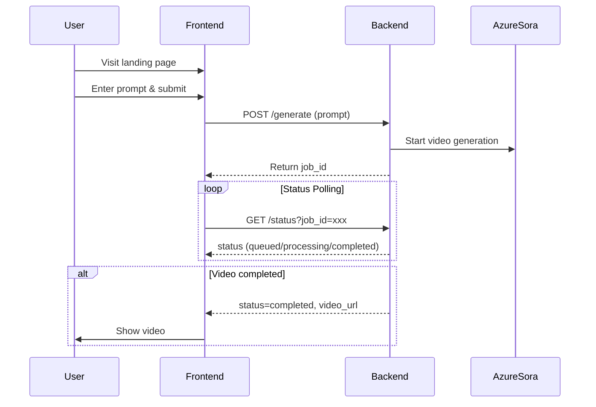

# Video Generation Workflow Documentation

## Overview
This document describes the user flow and workflow for the video generation web application using Azure OpenAI Sora. The focus is on the steps from the landing page to video generation, using only natural language prompts. Now includes status polling for progress updates.

## User Flow Steps
1. **Landing Page**: User visits the web application landing page.
2. **Prompt Input**: User enters a natural language prompt describing the desired video.
3. **Submit Request**: User submits the prompt.
4. **Backend Processing**: The backend receives the prompt and sends it to Azure OpenAI Sora for video generation.
5. **Status Polling**: Frontend polls the backend for the status of the video generation (e.g., queued, processing, completed).
6. **Progress Display**: UI shows progress/status updates to the user during generation.
7. **Video Generation**: Azure OpenAI Sora processes the prompt and generates a video.
8. **Receive Video**: The backend receives the generated video and sends it to the frontend.
9. **Display Video**: The frontend displays the generated video to the user for viewing or download.

## Workflow Diagram

## Notes
- Status polling allows the UI to show real-time progress.
- Backend must provide endpoints for job submission and status checking.
- Only natural language prompts are supported.
- Only Azure OpenAI Sora is used for video generation.
- Error handling and validation are not covered at this stage.
