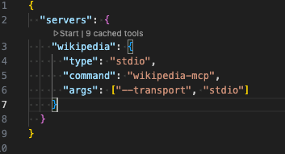
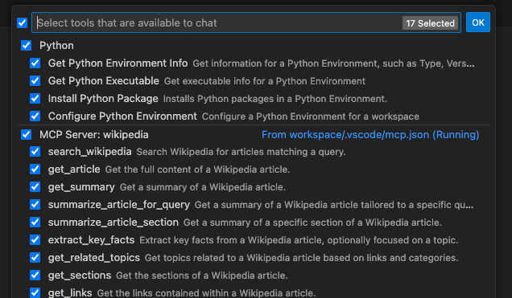

# 🧪 Lab 1: Integrate the Wikipedia MCP Server with GitHub Copilot Chat

This lab walks you through the process of **installing the Wikipedia MCP server**, configuring it in **VS Code Copilot Chat**, and interacting with it using natural language prompts.

---

## ✅ What You’ll Learn

- How to install an MCP-compliant server
- How to wire it into VS GitHub Copilot Chat using `mcp.json`
- How to invoke Wikipedia tools from within Copilot Chat

---

## ⚙️ Step 1: Install the Wikipedia MCP Server

The [`wikipedia-mcp`](https://github.com/rudra-ravi/wikipedia-mcp) tool provides structured access to Wikipedia using the **Model Context Protocol** (MCP).

Install the mcp server locally using pip:

```bash
pip install wikipedia-mcp
```

Verify the installation:

```bash
wikipedia-mcp --help
```

## 🧠 Step 2: What Can This Server Do?

The [`wikipedia-mcp`](https://github.com/rudra-ravi/wikipedia-mcp) tool provides structured access to Wikipedia using the **Model Context Protocol** (MCP). It exposes the following tools:

| Tool Name          | Description                          |
| ------------------ | ------------------------------------ |
| `search_wikipedia` | Search Wikipedia articles            |
| `get_summary`      | Get a brief summary of a topic       |
| `get_article`      | Get full article content             |
| `get_sections`     | List all sections of an article      |
| `get_links`        | List hyperlinks from a given article |

---

## 🛠️ Step 3: Configure VS Code Copilot with `.vscode/mcp.json`

1. Create or open the file at:

   ```plaintext
   .vscode/mcp.json
   ```

2. Add the following content:
   ```
   {
     "servers": {
       "wikipedia": {
         "type": "stdio",
         "command": "wikipedia-mcp",
         "args": ["--transport", "stdio"]
       }
     }
   }
   ```
3. Start the server.

   

## 🛠️ Step 4: Try it out!

1. Make sure that Agent mode is enabled.

   

2. Make sure that the wikipedia mcp server is enabled

   

3. Try the following prompts in Copilot Chat:

   ```bash
   @wikipedia search_wikipedia query="Microsoft Azure"
   @wikipedia get_summary title="Large language model"
   @wikipedia get_article title="Artificial intelligence"
   @wikipedia get_sections title="Machine learning"
   @wikipedia get_links title="Neural network"
   ```

4. Or just ask about any general topic.

   ```
   Can you tell me about Copilot?
   ```

## 🧠 How It Works

GitHub Copilot Chat communicates with wikipedia-mcp using the Model Context Protocol (MCP). It sends tool invocation requests as JSON over standard input/output, allowing your chat agent to interact with structured tools like Wikipedia in real time.
